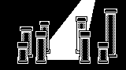

# crystals

   

    

Crystals is a roguelike with JRPG elements.

# The team

- [Adorikill](https://github.com/AdOrikll) : Graphics
- [Le ArtRemix](https://twitter.com/leartremix) : Music
- [yopox](https://www.github.com/yopox) : Code